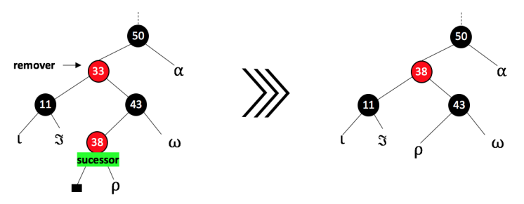

# Comparações das estruturas em árvores

 
 
 

O objetivo deste progama é poder fazer a comparação entre as estruturas estudadas em sala: árvore binária, árvore avl e árvore redblack, junto com ou outras estrutuas como vetor, map, e unordered_map do C++. Ao rodar o programa vai parecer duas opoções uma de gerar os arquivos para fazer os testes e uma para fazer os testes. A primeira opção vai gerar um arquivo "insercao.txt" com 500000 pontos flutuantes entre 0 e 1000000 e um arquivo "pesquisa.txt" com 10000 pointos flutuantes que por volta de 80% deles são pontos flutuantes que estão no arquivo gerado anteriormente e os outros 20% são pontos flutuantes que não estão. Já a segunda opção pega os arquivos gerados pela primeira e os usa para criar as estruturas para fazer as comparações.

# Estruturas utilizadas

Pode se encontrar mais informações sobre as estruturas utilizadas informadas anteriormente em: <a href="https://github.com/mpiress/basic_tree">árvore binária</a>, <a href="https://github.com/mpiress/avl_tree">árvore avl</a>, <a href="https://github.com/mpiress/RedBlack">árvore redblack</a>, <a href="https://www.freecodecamp.org/portuguese/news/map-em-c-mais-mais-explicado-com-exemplos/#:~:text=map%20%C3%A9%20um%20cont%C3%AAiner%20que,ou%20aos%20objetos%20em%20JavaScript.">map</a>, <a href="https://www.mygreatlearning.com/blog/unordered_map-in-cpp/#:~:text=The%20unordered_map%20in%20C%2B%2B%20is,based%20on%20their%20unique%20key.">unordered_map</a> e <a href="https://www.geeksforgeeks.org/vector-in-cpp-stl/">vetor</a>. 

No link da árvore redblack não se tem a explicação da remoção, pois ela não foi implementada. A remoção nas árvores redblack se inicia com uma etapa de busca e remoção como nas árvores binárias de busca convencionais. Então se alguma propriedade vermelho-preta for violada, a árvore deve ser rebalanceada. Caso a remoção efetiva seja de um nó vermelho, esta é realizada sem problemas, pois todas as propriedades da árvore se manterão intactas. Se o nó a ser removido for preto, a quantidade de nós pretos em pelo menos um dos caminhos da árvore foi alterado, o que implica que algumas operações de rotação e/ou alteração de cor sejam feitas para manter o balanceamento da árvore. As remoções podem ser dividas nos seguintes casos:

<b>Caso 1:</b> O nó a ser removido é vermelho e possui apenas um único filho ou não possui filhos. 
<b>Correção:</b> Remoção análoga ao de uma árvore binária comum.

<b>Caso 2:</b> O nó a ser removido é vermelho e seu sucessor também é vermelho 
<b>Correção:</b> Remoção análoga ao de uma árvore binária comum.

<b>Caso 3:</b> O nó a ser removido é preto e seu sucessor é vermelho 
<b>Correção:</b> Remova o nó, substitua pelo sucessor e pinte o sucessor de preto.

O problema do duplo preto ocorre quando retiramos um nó preto. Como a árvore se baseia no número de pretos para validar suas propriedades, ela acaba tendo que compensar isso na remoção. Existem 4 casos a tratar quando o sucessor a ser removido é preto. Para compreender o caso 4, considere a seguinte nomenclatura: 
- <b>z:</b> O nó a ser removido.
- <b>y:</b> o sucessor de z.
- <b>x:</b> O filho do sucessor antes de qualquer modificação.
- <b>w:</b> O irmão de x antes da remoção de z.

<b>Caso 4:</b>  O nó a ser removido e seu sucessor são pretos: 
- <b>Caso 4.1:</b> O irmão w de x é vermelho.
- <b>Caso 4.2:</b> O irmão w de x é preto e ambos os filhos de w são pretos.
- <b>Caso 4.3:</b> O irmão w de x é preto, o filho esquerdo de w é vermelho e o da direita preto..
- <b>Caso 4.4:</b> O irmão w de x é preto e o filho direito de w é vermelho.

<b>Caso 4.1:</b> O irmão w de x é vermelho. 
- Como w é vermelho, ambos os filhos são pretros. Logo:
  - Trocar as cores de w e x.pai
  - Realizar rotação à esquerda tendo como ponto de observação x.pai
- Essas alterações não violam nenhuma propriedade da árvore. Contudo, leva o Caso 4.1 para os demais casos citados.

<b>Caso 4.2:</b> O irmão w de x é preto e ambos os filhos de w são pretos. 
- Atualizamos w para vermelho
- Atualizamos x levando-o para o se pai
- Repetimos o processo a partir do novo x.

<b>Caso 4.3:</b> O irmão w de x é preto, o filho esquerdo de w é vermelho e o filho da direita é preto. 
- Troca-se a cor de w e de seu filho esquerdo.
- Rotaciona a árvore para a direita usando como pivô w.
- Neste ponto, o novo irmão wde x é preto com o filho da direita na cor vermelha, o que nos leva ao caso 4.4.

<b>Caso 4.4:</b> O irmão w de x é preto e o filho direito de w é vermelho. 
- Rotaciona a árvore para a esquerda usando como pivô x.pai.
- w é pintado com a cor de x.pai
- x.pai é pintado de preto
- Pintar o filho direito de w de preto

<b>Caso 5:</b> O nó a ser removido é vermelho e x, irmão de sucessão, é preto. 
- Pinte x de vermelho
- Resolva problemas pelos casos 4.x.

# Compilação e Execução

O código disponibilizado possui um arquivo Makefile que realiza todo o procedimento de compilação e execução. Para tanto, temos as seguintes diretrizes de execução:

| Comando                |  Função                                                                                           |
| -----------------------| ------------------------------------------------------------------------------------------------- |
|  `make clean`          | Apaga a última compilação realizada contida na pasta build                                        |
|  `make`                | Executa a compilação do programa utilizando o gcc, e o resultado vai para a pasta build           |
|  `make run`            | Executa o programa da pasta build após a realização da compilação                                 |

