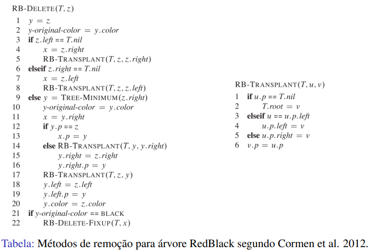

# Comparações das estruturas em árvores

 
 
 

O objetivo deste progama é poder fazer a comparação entre as estruturas estudadas em sala: árvore binária, árvore avl e árvore redblack, junto com ou outras estrutuas como vetor, map, e unordered_map do C++. Ao rodar o programa vai parecer duas opoções uma de gerar os arquivos para fazer os testes e uma para fazer os testes. A primeira opção vai gerar um arquivo "insercao.txt" com 500000 pontos flutuantes entre 0 e 1000000 e um arquivo "pesquisa.txt" com 10000 pointos flutuantes que por volta de 80% deles são pontos flutuantes que estão no arquivo gerado anteriormente e os outros 20% são pontos flutuantes que não estão. Já a segunda opção pega os arquivos gerados pela primeira e os usa para criar as estruturas para fazer as comparações.

# Estruturas utilizadas

Pode se encontrar mais informações sobre as estruturas utilizadas informadas anteriormente em: <a href="https://github.com/mpiress/basic_tree">árvore binária</a>, <a href="https://github.com/mpiress/avl_tree">árvore avl</a>, <a href="https://github.com/mpiress/RedBlack">árvore redblack</a>, <a href="https://www.freecodecamp.org/portuguese/news/map-em-c-mais-mais-explicado-com-exemplos/#:~:text=map%20%C3%A9%20um%20cont%C3%AAiner%20que,ou%20aos%20objetos%20em%20JavaScript.">map</a>, <a href="https://www.mygreatlearning.com/blog/unordered_map-in-cpp/#:~:text=The%20unordered_map%20in%20C%2B%2B%20is,based%20on%20their%20unique%20key.">unordered_map</a> e <a href="https://www.geeksforgeeks.org/vector-in-cpp-stl/">vetor</a>. 

No link da árvore redblack não se tem a explicação da remoção, pois ela não foi implementada. A remoção nas árvores redblack se inicia com uma etapa de busca e remoção como nas árvores binárias de busca convencionais. Então se alguma propriedade vermelho-preta for violada, a árvore deve ser rebalanceada. Caso a remoção efetiva seja de um nó vermelho, esta é realizada sem problemas, pois todas as propriedades da árvore se manterão intactas. Se o nó a ser removido for preto, a quantidade de nós pretos em pelo menos um dos caminhos da árvore foi alterado, o que implica que algumas operações de rotação e/ou alteração de cor sejam feitas para manter o balanceamento da árvore. As remoções podem ser dividas nos seguintes casos:

<b>Caso 1:</b> O nó a ser removido é vermelho e possui apenas um único filho ou não possui filhos. 
<b>Correção:</b> Remoção análoga ao de uma árvore binária comum.

<b>Caso 2:</b> O nó a ser removido é vermelho e seu sucessor também é vermelho 
<b>Correção:</b> Remoção análoga ao de uma árvore binária comum.

<b>Caso 3:</b> O nó a ser removido é preto e seu sucessor é vermelho 
<b>Correção:</b> Remova o nó, substitua pelo sucessor e pinte o sucessor de preto.

O problema do duplo preto ocorre quando retiramos um nó preto. Como a árvore se baseia no número de pretos para validar suas propriedades, ela acaba tendo que compensar isso na remoção. Existem 4 casos a tratar quando o sucessor a ser removido é preto. Para compreender o caso 4, considere a seguinte nomenclatura: 
- <b>z:</b> O nó a ser removido.
- <b>y:</b> o sucessor de z.
- <b>x:</b> O filho do sucessor antes de qualquer modificação.
- <b>w:</b> O irmão de x antes da remoção de z.

<b>Caso 4:</b>  O nó a ser removido e seu sucessor são pretos: 
- <b>Caso 4.1:</b> O irmão w de x é vermelho.
- <b>Caso 4.2:</b> O irmão w de x é preto e ambos os filhos de w são pretos.
- <b>Caso 4.3:</b> O irmão w de x é preto, o filho esquerdo de w é vermelho e o da direita preto..
- <b>Caso 4.4:</b> O irmão w de x é preto e o filho direito de w é vermelho.

<b>Caso 4.1:</b> O irmão w de x é vermelho. 
- Como w é vermelho, ambos os filhos são pretros. Logo:
  - Trocar as cores de w e x.pai
  - Realizar rotação à esquerda tendo como ponto de observação x.pai
- Essas alterações não violam nenhuma propriedade da árvore. Contudo, leva o Caso 4.1 para os demais casos citados.

<b>Caso 4.2:</b> O irmão w de x é preto e ambos os filhos de w são pretos. 
- Atualizamos w para vermelho
- Atualizamos x levando-o para o se pai
- Repetimos o processo a partir do novo x.

<b>Caso 4.3:</b> O irmão w de x é preto, o filho esquerdo de w é vermelho e o filho da direita é preto. 
- Troca-se a cor de w e de seu filho esquerdo.
- Rotaciona a árvore para a direita usando como pivô w.
- Neste ponto, o novo irmão wde x é preto com o filho da direita na cor vermelha, o que nos leva ao caso 4.4.

<b>Caso 4.4:</b> O irmão w de x é preto e o filho direito de w é vermelho. 
- Rotaciona a árvore para a esquerda usando como pivô x.pai.
- w é pintado com a cor de x.pai
- x.pai é pintado de preto
- Pintar o filho direito de w de preto

<b>Caso 5:</b> O nó a ser removido é vermelho e x, irmão de sucessão, é preto. 
- Pinte x de vermelho
- Resolva problemas pelos casos 4.x.

# Execução do programa

Como dito anteriormente quando o programa roda é apresentados as opções que podem ser escolhidas por meio de um menu, a imagem abaixo mostra o menu. As opções são 1 - Criar os arquivos que criar os arquivos "insercao.txt" e "pesquisa.txt", 2 - Criar as estruturas que faz o objetivo do programa e 3 - Sair para não fazer fazer nada no programa. Quando a opção 1 é escolhida o programa só vai gerar os arquivos e parar, para a geração do arquivo voi se utilizado a biblioteca <a href="https://cplusplus.com/reference/random/">random</a> pois ela me dá uma geração de números aleatórios mais uniforme do que usando a rand, está opção demora bastante para rodar por causa da geração do arquivo "pesquisa.txt" pois nele quando se é pego um número do arquivo "insercao.txt", que são guardados em um vetor, é pego o último e depois um shuffle é feito no vetor. Como 80% dos números são do arquivo de inserção o shuffle é chamado muitas vezes o que causa um gargalo na execução.
  

Já na opção 2 a primeira coisa que acontece é um pergunta, a imagem abaixo mostra ela, que serve para ver quantas vezes o progrma precisa chamar o método "readFiles". Quando o método é chamado todos os dados nos arquivos "insercao.txt" e "pesquisa.txt" são colocados em vectors insertion e search respectivamente, depois é se feito as estruturas com as seguintes quatidades de inserções: 500, 5000, 50000 e 500000, o tempo que cada estrutura demora para guarda estes dados é salvado. Depois da inserção em uma das estruturas é se feito a pesquisa dos 10000 dados em search, também se gurada o tempo para fazer isto, e os dados que forem encontrados são printados e colocados em um vector para serem removidos. Depos de fazer a pesquisa é se removido os dados encontrados que estão no vector remover, o tempo para fazer isto é guardado. Depois de fazer todas estas operações com todas as estruturas com as 500 inserções, os vectors insertion e search são embaralhados para fazer as inserções com 5000, e assim por adiante.

Depois de rodar o método "readFiles" a quantidade de vezes informada o método "createTimeFile" é chamado para criar um arquivo "tempos.txt" com os resultados do tempo médio para fazer as opreção de inserção, busca e remoção nas estruturas com os tamnhos 500, 5000, 50000 e 500000 e os tempos individuas para cada teste.

# Resultado

O programa foi rodado em um computador ACER com Intel(R) Core(TM) i7-7500U CPU @ 2.70GHz-2.90 GHz, em WSL do Ubuntu. Para ter uma ideia bom tempo médio foi se informado na pergunta de quantas vezes que o programa deve roda que le deve rodar 100 vezes. Logo no arquivo "tempos.txt" está os resultados médio e de cada teste. Os resultados médio obtidos foram:

# 500

- Tempo em milisegundos para fazer inserção:
  - Árvore Binária: 0.1559 ms
  - Arvore AVL:	0.4394 ms
  - Arvore RedBlack: 0.386 ms
  - Map: 0.46086 ms
  - Unordered Map: 0.366 ms
  - Vetor: 0.1532 ms

- Tempo em milisegundos para fazer a busca de 10000 números:
  - Árvore Binária: 2.31663	ms 
  - Arvore AVL:	3.8571 ms	
  - Arvore RedBlack: 3.65835 ms	
  - Map: 4.79674 ms	
  - Unordered Map: 2.62232 ms	
  - Vetor: 4.89012 ms

- Tempo em milisegundos para fazer a remoção dos números encontrados:
  - Árvore Binária: 0.00474 ms 
  - Arvore AVL:	0.00924 ms	
  - Arvore RedBlack: 0.00533 ms	
  - Map: 4.9629	ms	
  - Unordered Map: 0.00663 ms	
  - Vetor: 0.03258 ms

- Total do tempo:
  - Árvore Binária: 2.47727 ms
  - Arvore AVL: 4.30574 ms
  - Arvore RedBlack: 4.04968 ms
  - Map: 10,2205 ms
  - Unordered Map: 2,99798
  - Vetor: 5,0759 ms

# 5000

- Tempo em milisegundos para fazer inserção de 5000:
  - Árvore Binária: 3.12703	ms 
  - Arvore AVL:	6.48307	ms
  - Arvore RedBlack: 3.33092 ms	
  - Map: 5.10134 ms	
  - Unordered Map: 3.13201 ms	
  - Vetor: 1.80112 ms

- Tempo em milisegundos para fazer a busca de 10000 números:
  - Árvore Binária: 13.0352 ms
  - Arvore AVL: 12.4237 ms
  - Arvore RedBlack: 11.2505 ms
  - Map: 5.68217 ms
  - Unordered Map: 2.51355 ms
  - Vetor: 10.2879 ms

- Tempo em milisegundos para fazer a remoção dos números encontrados:
  - Árvore Binária: 0.09255 ms
  - Arvore AVL: 0.1215 ms
  - Arvore RedBlack: 0.09284 ms
  - Map: 6.36701 ms
  - Unordered Map: 0.05928 ms
  - Vetor: 2.2887 ms

- Total do tempo:
  - Árvore Binária: 26.25478 ms
  - Arvore AVL: 19.02827 ms
  - Arvore RedBlack: 14.67426 ms
  - Map: 17.15052
  - Unordered Map: 5.70484 ms
  - Vetor: 14.37772 ms

# 50000
  
- Tempo em milisegundos para fazer inserção:
  - Árvore Binária: 31.4396 ms 
  - Arvore AVL:	45.5152 ms	
  - Arvore RedBlack: 34.735 ms	
  - Map: 53.0424 ms	
  - Unordered Map: 33.7583 ms	
  - Vetor: 22.9226 ms
  
- Tempo em milisegundos para fazer a busca de 10000 números:
  - Árvore Binária: 33.1537 ms
  - Arvore AVL: 23.9372 ms
  - Arvore RedBlack: 27.9129 ms
  - Map: 6.80214 ms
  - Unordered Map: 2.70658 ms
  - Vetor: 26.9905 ms

- Tempo em milisegundos para fazer a remoção dos números encontrados:
  - Árvore Binária: 1.1777 ms
  - Arvore AVL: 1.34458 ms
  - Arvore RedBlack: 1.35012 ms
  - Map: 7.88548 ms
  - Unordered Map: 0.46252 ms
  - Vetor: 157.328 ms

- Total do tempo:
  - Árvore Binária: 65.771
  - Arvore AVL: 70.79698 ms
  - Arvore RedBlack: 63.99802 ms
  - Map: 67.73002 ms
  - Unordered Map: 36;93008
  - Vetor: 207,2411

# 500000
  
- Tempo em milisegundos para fazer inserção:
  - Árvore Binária: 525,226 ms 
  - Arvore AVL:	828,306 ms	
  - Arvore RedBlack:	607,355 ms	
  - Map: 790,596 ms	
  - Unordered Map: 454,039 ms	
  - Vetor: 267,728 ms

- Tempo em milisegundos para fazer a busca de 10000 números:
  - Árvore Binária: 124.497 ms
  - Arvore AVL: 109.595 ms
  - Arvore RedBlack: 120.843 ms
  - Map: 9.65191 ms
  - Unordered Map: 4.24394 ms
  - Vetor: 101.248 ms

- Tempo em milisegundos para fazer a remoção dos números encontrados:
  - Árvore Binária: 19.3126 ms
  - Arvore AVL: 18.4782 ms
  - Arvore RedBlack: 20.1956 ms
  - Map: 16.5998 ms
  - Unordered Map: 5.76537 ms
  - Vetor: 13887.3 ms

- Total do tempo:
  - Árvore Binária: 669.0356 ms
  - Arvore AVL: 1036.3792 ms
  - Arvore RedBlack: 748.3936 ms
  - Map: 816.84771 ms
  - Unordered Map: 464.04831 ms
  - Vetor: 14256.276 ms

# Compilação e Execução

O código disponibilizado possui um arquivo Makefile que realiza todo o procedimento de compilação e execução. Para tanto, temos as seguintes diretrizes de execução:

| Comando                |  Função                                                                                           |
| -----------------------| ------------------------------------------------------------------------------------------------- |
|  `make clean`          | Apaga a última compilação realizada contida na pasta build                                        |
|  `make`                | Executa a compilação do programa utilizando o gcc, e o resultado vai para a pasta build           |
|  `make run`            | Executa o programa da pasta build após a realização da compilação                                 |

